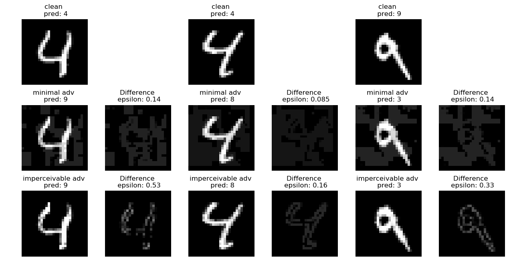
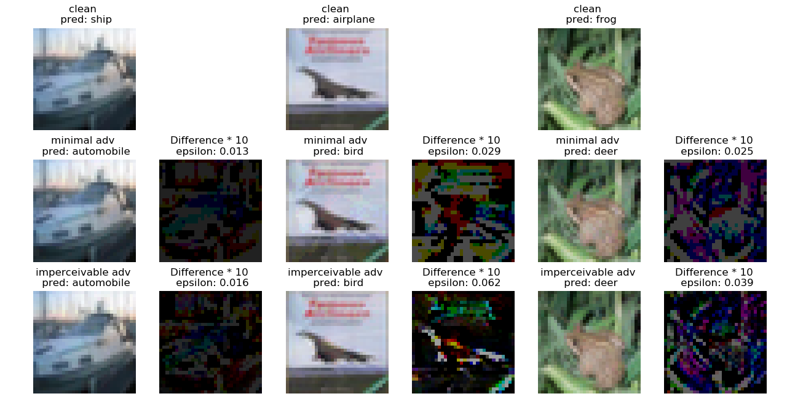
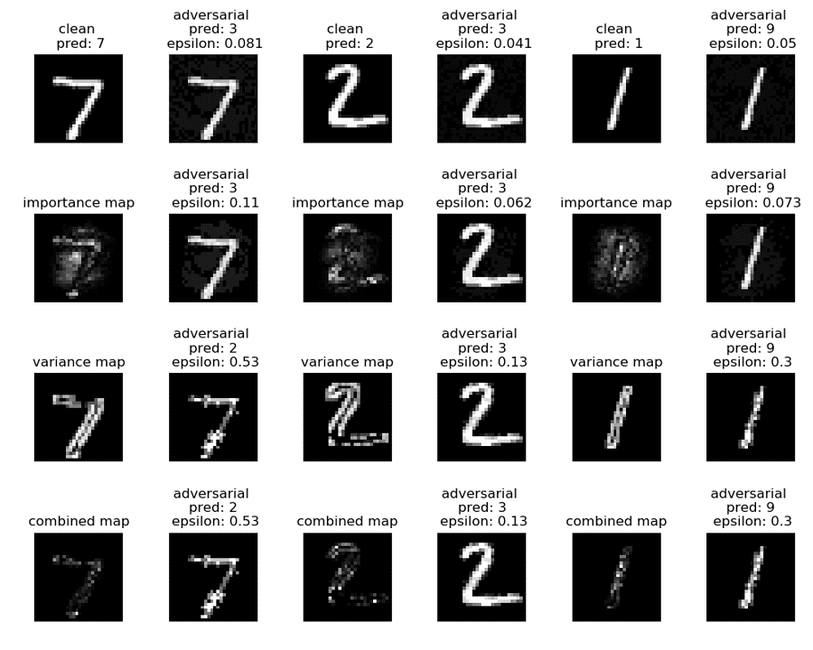
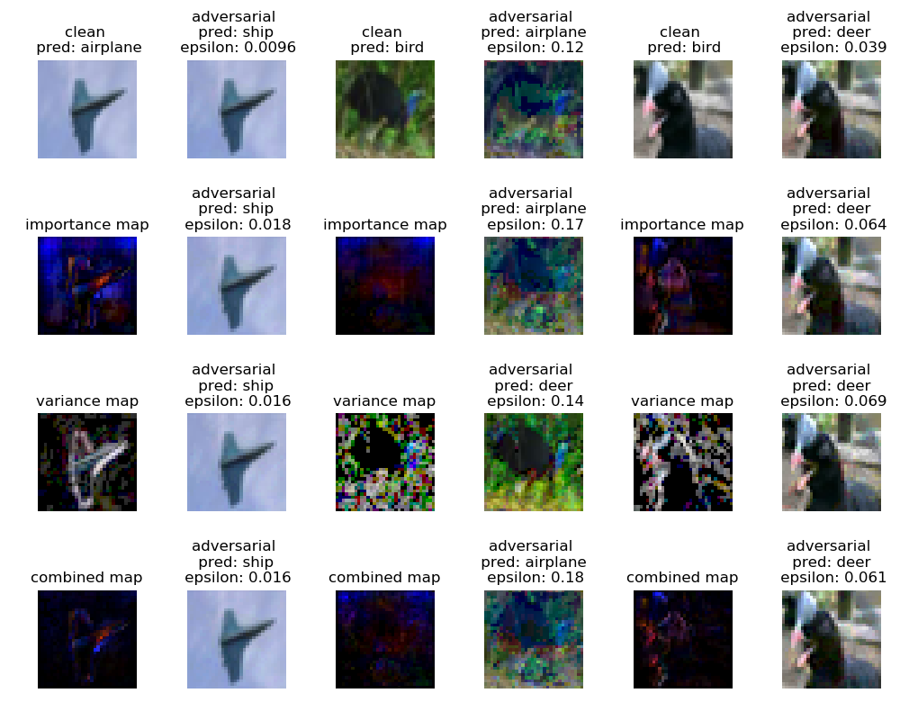
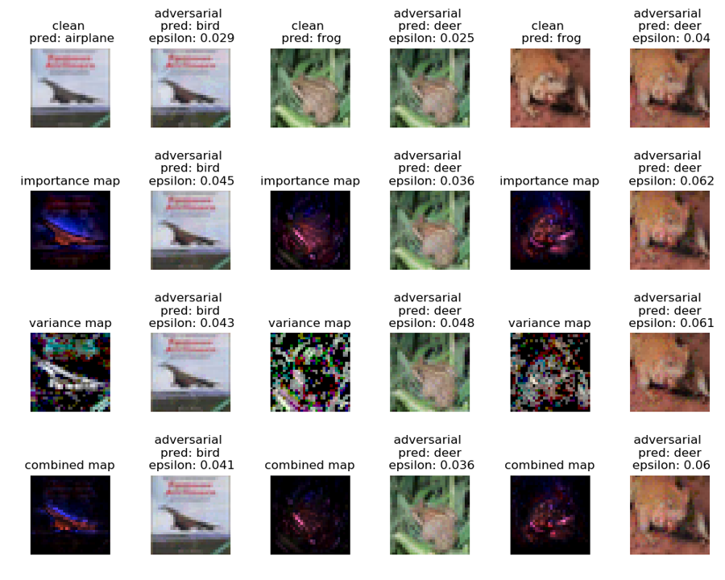

# CEXCustomized
### regional
| model | image index | patch size | success rate | importance l_inf | min l_inf | mean l_inf | max l_inf |
| ---- | ---- | ---- | ---- | ---- | ---- | ---- | ---- |
| mnist_relu_9_200 | 0 | 10 * 10 | 0.9506 | 0.2806 | 0.2193 | 0.4466 | 0.8093 |
| mnist_relu_9_200 | 1 | 10 * 10 | 1.0 | 0.1461 | 0.1394 | 0.2904 | 0.7276 |
| mnist_convSmallRELU | 0 | 10 * 10 | 0.7716 | 0.3746 | 0.3177 | 0.4974 | 0.9619 |
| mnist_convSmallRELU | 1 | 10 * 10 | 0.8488 | 0.3712 | 0.3448 | 0.5394 | 0.8887 |
| cifar10_relu_6_500 | 1 | 10 * 10 | 1.0 | 0.01934 | 0.01857 | 0.03065 | 0.04564 |
| cifar10_relu_6_500 | 3 | 10 * 10 | 1.0 | 0.03461 | 0.0329 | 0.04747 | 0.07872 |
| cifar10_convMedGSIGMOID | 0 | 10 * 10 | 1.0 | 0.04311 | 0.03809 | 0.07932 | 0.2288 |
| cifar10_convMedGSIGMOID | 1 | 10 * 10 | 1.0 | 0.01391 | 0.0126 | 0.02307 | 0.03975 |
| cifar10_convBigRELU_DiffAI | 1 | 10 * 10 | 1.0 | 0.1262 | 0.06374 | 0.1584 | 0.3262 |
| cifar10_convBigRELU_DiffAI | 2 | 10 * 10 | 0.9876 | 0.1127 | 0.09065 | 0.1697 | 0.3997 |
| cifar10_ResNet18_PGD | 1 | 10 * 10 | 0.8988 | 0.1366 | 0.1305 | 0.2843 | 0.7108 |
| cifar10_ResNet18_PGD | 2 | 10 * 10 | 1.0 | 0.04662 | 0.02792 | 0.1215 | 0.298 |
| stl10 | 3 | 10 * 10 | 0.9208 | 0.1641 | 0.06348 | 0.2755 | 0.8701 |
| stl10 | 7 | 10 * 10 | 0.9932 | 0.01966 | 0.01319 | 0.1080 | 0.9707 |

We exhaustively search all 10 * 10 region in a image and apply attack, record the success rate, (max, mean, min) of the 
resulting L_inf distances, and the L_inf distances of the region selected by our importance map (our method). We find 
that our method often select relatively good regions in affordable time. For cifar10_ResNet18_PGD (image size 32 * 32), 
exhaustive search cost 2150 seconds, while our importance map method cost 27 seconds. 
For stl10 (image size 96 * 96), exhaustive search cost more than 10000 seconds.

### imperceivable
| model | imperceivable | precision | attack success rate | l_0 | l_2 | l_inf | ssim | CIEDE2000|
| ---- | ---- | ---- | ---- | ---- | ---- | ---- | ---- | ---- |
| mnist_relu_9_200 | no | 97%(97/100) | 100%(97/97) | 507.14 | 2.23 | 0.06 | 0.82 |
| mnist_relu_9_200 | yes | 97%(97/100) | 49%(48/97) | 134.62 | 3.28 | 0.28 | 0.95 |
| mnist_convSmallRELU | no | 100%(100/100) | 100%(100/100) | 401.45 | 9.09 |  0.15 | 0.72 |
| mnist_convSmallRELU | yes | 100%(100/100) | 36%(36/100) | 138.25 | 3.87 | 0.32 | 0.94 |
| cifar10_ResNet18_PGD | no | 83%(83/100) | 100%(83/83) | 3051.73 | 5.27 |  0.04 | 0.93 | 162.50 |
| cifar10_ResNet18_PGD | yes | 83%(83/100) | 77%(64/83) | 2893.23 | 2.76 |  0.08 | 0.97 | 113.11 |
| cifar10_2_255 | no | 18%(18/100) | 100%(18/18) | 3063.11 | 8.45 |  0.05 | 0.90 | 240.95 |
| cifar10_2_255 | yes | 18%(18/100) | 56%(10/18) | 2982.60 | 4.80 |  0.15 | 0.96 | 183.77 |
| cifar10_relu_6_500 | no | 56%(56/100) | 100%(56/56) | 3050.93 | 0.27 |  0.01 | 0.99 | 52.50 |
| cifar10_relu_6_500 | yes | 56%(56/100) | 100%(56/56) | 2864.79 | 0.55 |  0.02 | 0.99 | 67.51 |
| cifar10_convSmallRELU | no | 59%(59/100) | 100%(59/59) | 2680.92 | 0.21 |  0.01 | 1.00 | 40.62 |
| cifar10_convSmallRELU | yes | 59%(59/100) | 100%(59/59) | 2570.73 | 0.24 |  0.01 | 1.00 | 43.76 |
| stl10 | no | 34%(34/100) | 100%(34/34) | 27381.77 | 1.42 |  0.01 | 0.98 | 149.80 |
| stl10 | yes | 34%(34/100) | 97%(33/34) | 24997.39 | 0.88 |  0.01 | 1.00 | 93.18 |

### BB statistics
| sample | delta = epsilon | delta = 0 | 0 < delta < epsilon |
| ---- | ---- | ---- | ---- |
|MNIST sample 1|480 |269 |35|
|MNIST sample 2|448 |296 |40|
|MNIST sample 3|453 |321 |10|
|MNIST sample 4|486 |249 |49|
|MNIST sample 5|426 |337 |21|
|CIFAR10 sample 1|3062 |0 |10|
|CIFAR10 sample 2|2875 |0 |40|
|CIFAR10 sample 3|3013 |4 |55|

### MNIST
| method | mnist_relu_9_200 | mnist_relu_6_100 | convSmallRELU__Point |
| ---- | ---- | ---- | ---- |
| DEEPFOOL | 0.07423 | 0.07331 | 0.1837 |
| FAB | 0.06379 | 0.06470 | 0.1571 |
| BB | 0.06358 | 0.06535 | 0.1558 |
| Ours | 0.06185 | 0.06281 | 0.1535 |
| FMN | 0.06153 | 0.06281 | 0.1692 |
| Ours-I (50% pixels) | 0.08699 | 0.09044 | 0.1623 |

#### mnist_relu_9_200

### Cifar10
| method | ffnnRELU__Point_6_500 | convSmallRELU__Point | ResNet18_PGD |
| ---- | ---- | ---- | ---- |
| DEEPFOOL | 0.01328 | 0.008010 | 0.04297 |
| FAB | 0.008917 | 0.007489 | 0.03434, 0.03458(alpha_max=0) |
| BB | 0.009386 | 0.007895 | 0.03629 |
| Ours | 0.008181 | 0.007383 | 0.03451 |
| FMN | 0.008186 | 0.007383 | 0.03451 |
| Ours-I (50% pixels) | 0.01657 | 0.01210 | 0.05569 |
| Ours-V (50% pixels) | 0.01817 | 0.01390 | 0.05534 |
| Ours-C (50% pixels) | 0.01677 | 0.01181 | 0.05100 |

#### cifar10_2_255

#### ResNet18_PGD

### STL10

