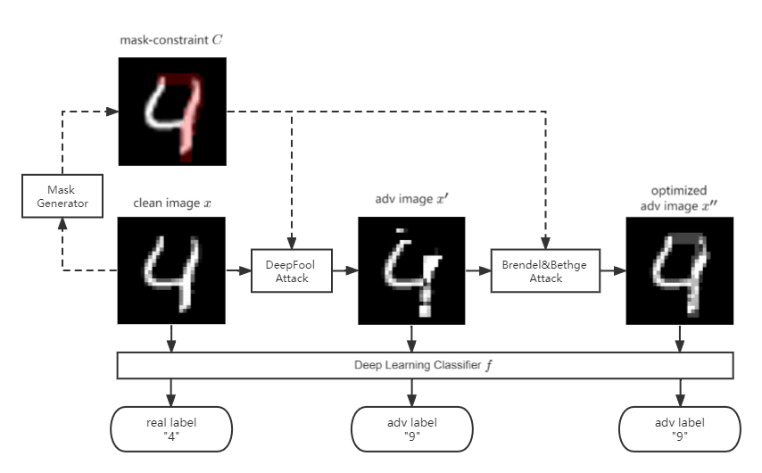
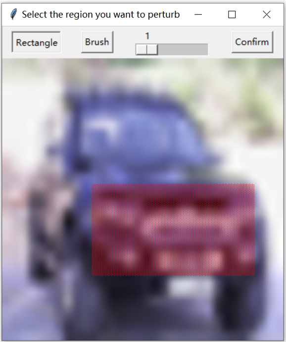
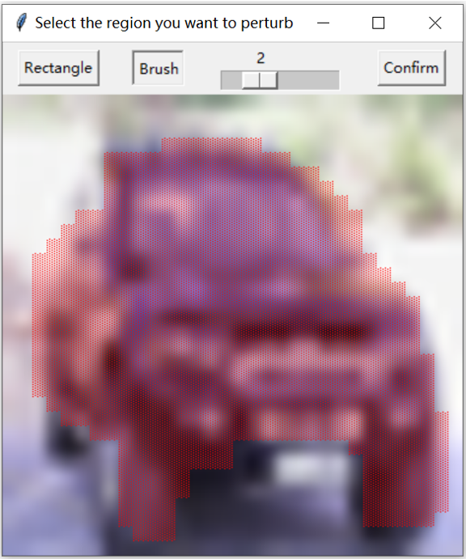
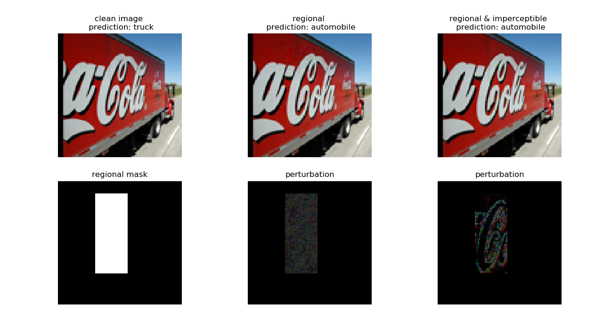

# ExploreADV

ExploreADV is flexible adversarial attack system that enables regional and imperceptible attacks. The primary functionalities are implemented in PyTorch.


## Requirements

torch; numpy; scipy; torchvision; onnx; onnx2pytorch; numba; Pillow; eagerpy; captum

## Running the example script:

Usage: 
```
python run_attack.py --dataset <cifar10/mnist/stl10> --path_model <path to the network file> --eps <float between 0 and 1> --region <whole/top/bottom/left/right/select> --imperceptible --n_examples <number of examples> --data_dir <path to data>
```

## Experiments

### Datasets and Models

| dataset | model | architecture | \#layers | #units | activation | training defense | accuracy |
| ---- | ---- | ---- | ---- | ---- | ---- | ---- | ---- |
| MNIST | M1 | fully connected | 9 | 1610 | ReLU | None | 0.95 |
| MNIST | M2 | convolutional | 3 | 3604 | ReLU | None | 0.98 |
| CIFAR10 | C1 | fully connected | 6 | 3000 | ReLU | None | 0.56 |
| CIFAR10  | C2 | convolutional | 3 | 5704 | Sigmoid | None | 0.55 |
| CIFAR10  | C3 | convolutional | 6 | 48064 | ReLU | DiffAI | 0.51 |
| CIFAR10  | C4 | residual | 19 | 558K | ReLU | PGD | 0.82 |
| STL10 | S1 | convolutional | 5 | 652K | ReLU | None | 0.77 |

### Base L_infty attack

Average L_infty norm for different L_infty attacks

| model | DEEPFOOL | FAB | BB | FMN | **ExploreADV** |
| ---- | ---- | ---- | ---- | ---- | ---- |
| M1 | 0.07423 | 0.06379 | 0.06358 | **0.06153** | 0.06182 |
| M2 | 0.1837 | 0.1571 | 0.1558 | 0.1692 | **0.1533** |
| C1 | 0.01328 | 0.008917 | 0.009386 | 0.008186 | **0.008179** |
| C2 | 0.01135 | 0.01082 | 0.01236 | 0.01169 | **0.01074** |
| C3 | 0.01731 | 0.01433 | 0.01424 | 0.01397 | **0.01370** |
| C4 | 0.04297 | 0.03434 | 0.03629 | 0.03477 | **0.03368** |
| S1 | 0.005805 | - |  0.004537 | 0.004575 | **0.004366** |

### Imperceptible Attack


### Regional & Imperceptible Attack

#### GUI



### Example

